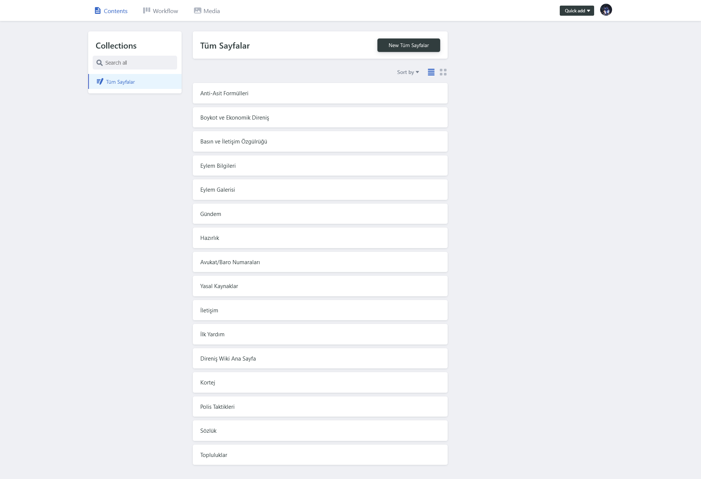
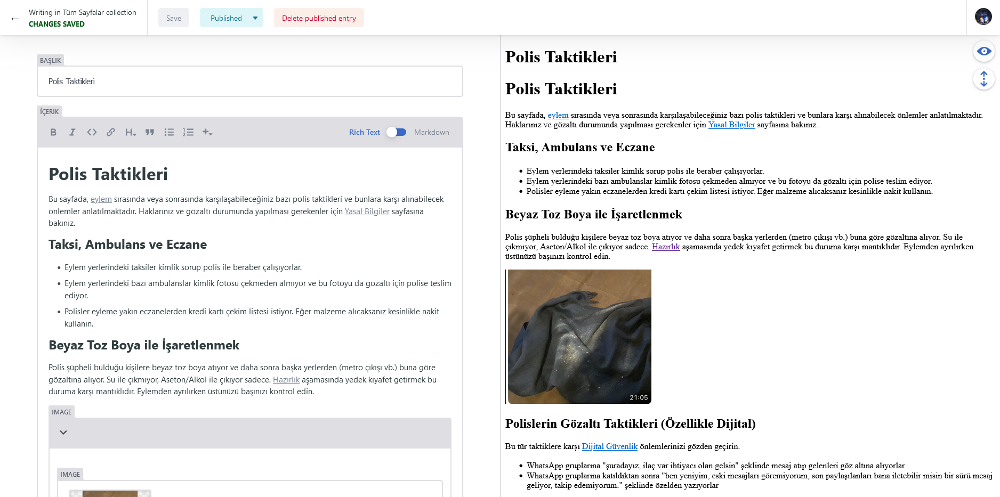

::: info Onay Prosedürü

Yaptığınız düzenlemeler, Github üzerinden bize iletildikten sonra moderatörlerimiz tarafından incelenir.  
Eğer içerik uygun bulunursa siteye eklenir.

Eksik veya hatalı bilgi içeren düzenlemeler reddedilebilir.  
Bazı durumlarda, moderatörler sizlerle iletişime geçerek gerekli düzeltmeleri birlikte yapabilir.

Platformumuz herhangi bir ideolojiye veya siyasi partiye bağlı değildir.
Amacımız, başta Türkiye olmak üzere, dünyadaki tüm otoriter rejimlere karşı özgür ve doğru bilgi sunmaktır.

:::

## 1- [Github](https://github.com) Hesabı
Öncelikle sitemiz DecapCMS adında bir "İçerik Yöneticisi" kullanmakta ve bu içerikleri düzenleyebilmek için bir Github hesabı oluşturmanız gerekiyor. [Websitemizin Github sayfasında](https://github.com/sylasthekingslayer/wiki) katkıda bulunan kullanıcılar gözükmektedir (istesek de bunu engelleyemiyoruz) bu yüzden **Anonim nicknameli** bir Github hesabı oluşturmanızı şiddetle tavsiye ediyoruz. 

## 2- CMS'e Giriş
* [direnis.net/admin/](https://direnis.net/admin/) linki üzerinden içerik yönetim sistemine giriş sayfasına gidin.

* Sizleri böyle bir sayfa karşılayacak.

* Gördüğünüz tek buton olan "Login with Github" butonuna tıklayın.

* Github hesabınızla giriş yapın. 
* Bir sorun olması dahilinde [iletisime](./iletisim.md) geçmekten çekinmeyin!

## 3- Ana Menü

* Oldukça basit bir arayüzü olan DecapCMS'e giriş yaptık ve ekteki sayfa bizi karşıladı.

* Öncelikle ana menüde gördüğünüz kartlara ek bir kart eklemek isterseniz "New Pages" butonuna tıklayın.

* Eğer yeni bir kart değil de mevcut bir kartı düzenlemek isterseniz aşağıda gördüğünüz sıralanmış sayfalardan düzenlemek istediğinize tıklayın.

## 4- Metin Düzenleme Sayfası
Sitemizdeki tüm içerikler **Markdown formatında** yazılır.  
Bu sayede hem sade kalır hem de düzenlemesi kolay olur.

---

"Title" olarak gördüğünüz şey tarayıcılarda bulunan sayfa başlığıdır.

Bir altındaki "Content" ise sayfa içeriğidir.

İçeriği düzenlerken iki görünüm arasında geçiş yapabilirsiniz:
- **Rich Text (Google Docs, Microsoft Word benzeri görsel düzenleyici)**
- **Markdown (kod editör)**

Hangisi kolayınıza geliyorsa onu kullanabilirsiniz, çoğu kullanıcı **Rich Text** kullanımına alışıktır.

### Markdown formatında yazmak isterseniz:

#### [Türkçe Rehber](https://medium.com/deep-learning-turkiye/t%C3%BCrk%C3%A7e-markdown-rehberi-61779d2e2a96)

#### [İngilizce Rehber](https://www.markdownguide.org/)
---

### Rich Text formatında yazmak isterseniz:

Google Docs, Word, Libreoffice gibi programlardan aşina olduğunuz iconları göreceksiniz bunlar sırayla:

**Bold**, **Italic**, **Code**, **Link**, **Heading(Başlık)**, **Quote(Alıntı)**, **Bullet List(Madde İmli Liste)**, **Numbered List(Numaralı Liste)**

"+" iconuna tıkladığımızda ise **Resim** ve **Kod bloğu** ekleme alanlarını görmekteyiz.

## 5- Değişiklikleri Kaydetmek

Sayfayı düzenledikten sonra sağ üst köşede bulunan **Save** (Kaydet) butonuna tıklayın.  
Ardından çıkan ekrandan "Submit" diyerek değişiklikleri bize gönderebilirsiniz.

Yaptığınız düzenleme, Github üzerinden bir **Pull Request (PR)** olarak bize ulaşır.  
İçeriği inceleyen moderatörlerimiz uygun görürse siteye eklenir.
